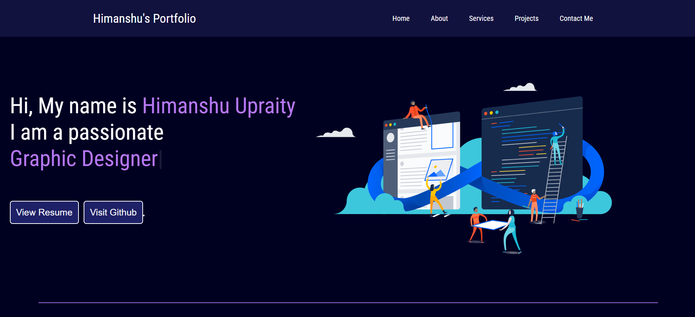

<h2 align="center">
  Portfolio Website 
  Himanshu Upraity
</h2>

  
  

 &nbsp;
 &nbsp;
 &nbsp;
 &nbsp;

<h3>Built With</h3>

My personal portfolio, which features some of my github projects as well as my resume and technical skills. 

This project was built using these technologies.

- HTML
- CSS3
- Java Script
- VsCode
